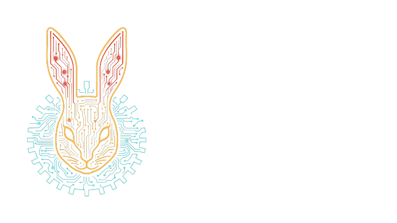

# kotlin-data-ref



<p align=center>
    
    
</p>

`kotlin-data-ref` provides small identity-based collection helpers for Kotlin Multiplatform code.

Use it when object identity matters more than structural equality: graph algorithms, object
interning, cycle detection, memoization keyed by object references, and diagnostics that need to
distinguish equal-but-distinct objects.

## 🚀 Installation

```kotlin
commonMain.dependencies {
    implementation("one.wabbit:kotlin-data-ref:1.1.1")
}
```

## 🚀 Usage

```kotlin
import one.wabbit.data.Ref
import one.wabbit.data.identitySetOf

data class Node(val id: Int)

val a = Node(1)
val b = Node(1)

check(a == b)
check(Ref(a) != Ref(b))

val nodes = identitySetOf(a, b)
check(nodes.size == 2)
```

`Ref` delegates hashing to the platform identity hash code and compares wrapped values with `===`.
That makes it suitable as a key when the wrapped type has structural `equals`/`hashCode` behavior
that you explicitly do not want.

`Ref.toString()` is diagnostic-only. For non-null values it includes a platform class name and
unsigned hexadecimal identity hash; for null it returns `Ref[null]`. The exact output should not be
parsed.

## Status

This library is small and stable in scope, but it is still pre-2.0. Public API changes should be
rare and documented in release notes.

## Identity Collections

```kotlin
import one.wabbit.data.identityMap
import one.wabbit.data.identitySetOf

val first = String(charArrayOf('x'))
val second = String(charArrayOf('x'))

val set = identitySetOf(first, second)
check(set.size == 2)

val map = identityMap<String, Int>()
map[first] = 1
map[second] = 2

check(map[first] == 1)
check(map[second] == 2)
```

## Distinct By Identity

```kotlin
import one.wabbit.data.distinctByIdentity

val item = Any()
val values = listOf(item, Any(), item)

check(values.distinctByIdentity().size == 2)
```

The iterable overload returns a `List`. The sequence overload filters lazily and keeps one identity
set of already-seen references for the duration of iteration.

## Documentation

- [User guide](docs/user-guide.md)
- [API reference notes](docs/api-reference.md)
- [Troubleshooting](docs/troubleshooting.md)
- [Development](docs/development.md)

Generated API docs can be built locally with Dokka. See [API reference notes](docs/api-reference.md)
for the command.

## Release Notes

- [CHANGELOG.md](CHANGELOG.md)

## Licensing

This project is licensed under the GNU Affero General Public License v3.0 (AGPL-3.0) for open
source use.

For commercial use, contact Wabbit Consulting Corporation at `wabbit@wabbit.one`.

## Contributing

Contributions are governed by the repository contribution policy and the Wabbit CLA. See
`CONTRIBUTING.md` and the files under `legal/`.
